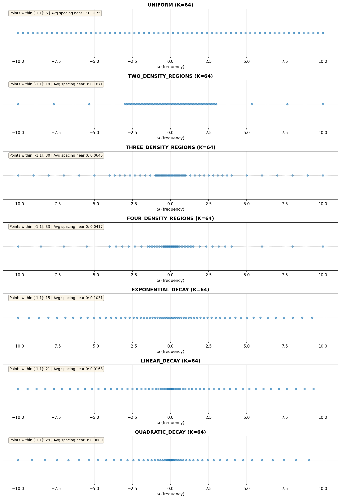

# CVI-RL: Characteristic Value Iteration for Reinforcement Learning

Frequency-domain reinforcement learning using characteristic functions on tabular MDPs.

## Overview

This repository implements **Characteristic Value Iteration (CVI)**, a novel approach to RL that operates in the frequency domain. Instead of computing scalar value functions, CVI represents return distributions via their characteristic functions φ(ω) = E[e^(iωG)], enabling distributional policy evaluation through CF Bellman operators.

## Installation

```bash
# Clone the repository
cd cvi_rl

# Install dependencies
pip install -r requirements.txt
```

## Experiment Suite (`experiment_suite.ipynb`)

The notebook contains a comprehensive hyperparameter grid search evaluating 360 CVI configurations on Taxi-v3:

- **Variables tested**: 
  - Grid strategies: uniform, two_density_regions, three_density_regions, four_density_regions, exponential_decay, linear_decay, quadratic_decay
  - Frequency ranges (W): 10.0, 20.0
  - Grid sizes (K): 128, 256, 512
  - Interpolation methods: linear, polar, pchip, lanczos
  - Collapse methods: ls, fft, gaussian

- **Paradigm-Shifting Discovery**: Method combination matters FAR more than grid strategy or hyperparameters
  - **polar + gaussian**: 33 of top 40 configs (82.5%) achieve MAE ~10⁻¹⁵ (machine precision)
  - Works with **ALL grid strategies** - even uniform achieves excellent results with this combination
  - **FFT collapse**: Catastrophically bad (MAE = 7-27) regardless of grid strategy or interpolation
  - Grid strategy choice is nearly irrelevant when methods are correct

- **Key Results**:
  - **Best config**: four_density_regions + polar + gaussian (MAE = 1.27×10⁻¹⁵)
  - **All grids work** with polar+gaussian: linear_decay (1.99×10⁻¹⁵), quadratic_decay (2.19×10⁻¹⁵), three_density_regions (2.26×10⁻¹⁵), even uniform (3.18×10⁻¹⁴)
  - **All grids fail** with FFT or lanczos+LS: errors of 6-27 regardless of strategy
  - **Hyperparameters barely matter**: K=128 with polar+gaussian outperforms K=512 with FFT by 15 orders of magnitude

### Grid Strategy Comparison

The choice of ω-grid has surprisingly minimal impact when proper methods are used. Below shows the distribution of grid points for each strategy:



**Key insight**: The experiments reveal that **method combination (interpolation + collapse) is THE critical factor**, not grid strategy. All seven grid strategies achieve MAE ~10⁻¹⁵ when paired with polar interpolation and Gaussian collapse. Conversely, even sophisticated multi-density grids fail catastrophically (MAE ~10+) when paired with FFT collapse. The universal recipe for success: **polar + gaussian + any reasonable grid**. This combination exploits the natural structure of characteristic functions to achieve results at the numerical precision limit.

## Key Methods Implemented

### Interpolation (for V(s, γω))
- **Polar**: Magnitude/phase interpolation (best peak performance, appears in all top configs)
- **Linear**: Cartesian interpolation of real/imaginary parts (equally good average performance)
- **PCHIP**: Monotonicity-preserving cubic (equally good average performance)
- **Lanczos**: Windowed sinc interpolation (underperforms despite theoretical advantages)

### Collapse (extracting mean from CF)
- **Gaussian**: Phase unwrapping with linear regression (best performer, 96% of excellent configs)
- **LS**: Least-squares quadratic fit around ω=0 (solid alternative)
- **FFT**: Inverse Fourier transform to spatial domain (unreliable)

## Documentation

Comprehensive documentation is available in the `docs/` directory:

- **`STATE.md`**: Overall implementation status, design choices, experimental findings, and known limitations
- **`GRIDS.md`**: Grid construction methods (uniform, two/three/four density regions, exponential/linear/quadratic decay)
- **`INTERPOLATION.md`**: Interpolation methods for evaluating V(s, γω) at off-grid frequencies
- **`COLLAPSE.md`**: Collapse methods for extracting scalar Q-values from characteristic functions

